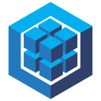

### Hi there 👋

My name is Andreas a.k.a. ⛰️ skoms, and I'm a Fullstack JavaScript Bootcamp graduate working on my programming and looking for a junior developer position!

## ⚙️ My Current Tech Stack

| Front-End                                                                                                                                                                                                                                                                                                                                                                                                                                                                                                                                                                                                                                                                                                                                                                                                                             | Back-End                                                                                                                                                                                                                                                                                                                                                                                                                                                              | Other                                                                                                                                                                                                                                                                                               |
| ------------------------------------------------------------------------------------------------------------------------------------------------------------------------------------------------------------------------------------------------------------------------------------------------------------------------------------------------------------------------------------------------------------------------------------------------------------------------------------------------------------------------------------------------------------------------------------------------------------------------------------------------------------------------------------------------------------------------------------------------------------------------------------------------------------------------------------- | --------------------------------------------------------------------------------------------------------------------------------------------------------------------------------------------------------------------------------------------------------------------------------------------------------------------------------------------------------------------------------------------------------------------------------------------------------------------- | --------------------------------------------------------------------------------------------------------------------------------------------------------------------------------------------------------------------------------------------------------------------------------------------------- |
| 
         
 | 
     
 | 
    
 |

## ⚙️ Familiarity with:

| Front-End                                                                                                                                                                                                                                                                                      | Back-End                                                                                |
| ---------------------------------------------------------------------------------------------------------------------------------------------------------------------------------------------------------------------------------------------------------------------------------------------- | --------------------------------------------------------------------------------------- |
|    |  |

## 📘 Side Project

I've worked many hours a day for about 3 months on this awesome social media project, <a href='https://www.github.com/skoms/researchers-refuge'>Researcher's Refuge</a>. I have been learning so much through this project, and you can read all about it there, conveniently in its `README.md` 😄

## ☎️ How To Reach Me

You can reach me through <a href='https://www.linkedin.com/in/andreas-skoms%C3%B8y-01a027188/'>LinkedIn  </a> or preferrably by 📧E-Mail: andrew.m.s.97@hotmail.com. The latter being checked more frequently.

<!--
**skoms/skoms** is a ✨ _special_ ✨ repository because its `README.md` (this file) appears on your GitHub profile.

Here are some ideas to get you started:

- 🔭 I’m currently working on ...
- 🌱 I’m currently learning ...
- 👯 I’m looking to collaborate on ...
- 🤔 I’m looking for help with ...
- 💬 Ask me about ...
- 📫 How to reach me: ...
- 😄 Pronouns: ...
- ⚡ Fun fact: ...
-->
